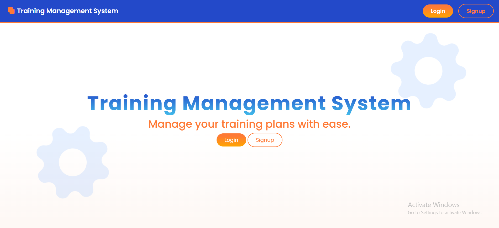
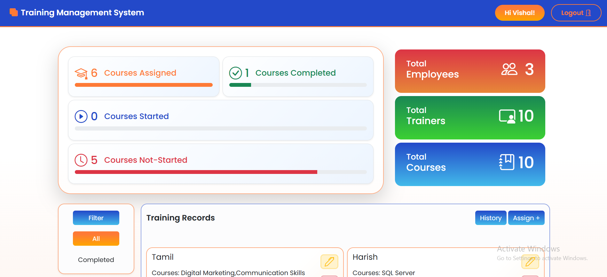
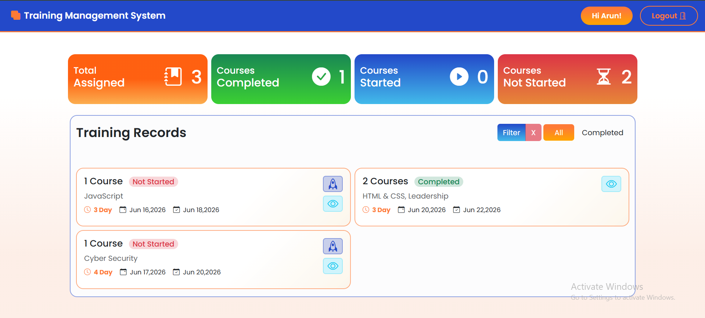

# Training Management System

## Overview

The Training Management System is a role-based web application that helps organizations manage employee training programs efficiently. Administrators can assign training courses, manage trainers, monitor employee progress, and maintain training history, while employees can view assigned courses and update their training status.

The application is built using HTML, CSS, Bootstrap, JavaScript, jQuery, and JSON Server as a mock backend.

---

## Features

### Authentication & Authorization

* User Registration
* User Login
* Role-based Dashboard Access
* Admin and Employee Roles
* Session Management using Local Storage

### Employee Features

* View Assigned Trainings
* Start Training
* Complete Training
* View Training Details
* Filter Trainings
* Track Progress Statistics
* View Personal Profile Information

### Admin Features

* Assign Trainings to Employees
* Update Assigned Trainings
* Soft Delete Training Records
* Restore Deleted Trainings
* Permanently Delete Trainings
* View Training History
* Filter Training Records
* Dashboard Analytics

### Validation Features

* Email Validation
* Password Validation
* Name Validation
* Date Validation
* Age Restriction (18+ years)
* Duplicate Course Assignment Prevention

---

---

## Screenshots

### Home Page

The landing page provides user authentication, registration, and an overview of the Training Management System features.



---

### Admin Dashboard

The admin dashboard allows administrators to manage employees, assign training programs, update records, track progress, view statistics, and manage training history.



---

### Employee Dashboard

The employee dashboard enables employees to view assigned trainings, track progress, start or complete courses, apply filters, and manage their profile information.



---


## Technology Stack

### Frontend

* HTML5
* CSS3
* Bootstrap 5
* JavaScript (ES6)
* jQuery

### UI Libraries

* Bootstrap Icons
* Toastr Notifications
* SweetAlert2
* Choices.js

### Backend

* JSON Server (Mock REST API)

---

## Project Structure

```text
Training-Management-System/
│
├── pages/
│   ├── index.html
│   ├── employeeDash.html
│   └── userDash.html
│
├── scripts/
│   ├── index.js
│   ├── empDash.js
│   └── userDash.js
│
├── styles/
│   └── index.css
│
├── db.json
│
└── README.md
```

---

## Application Flow

### User Registration

1. User opens the application.
2. Clicks Signup.
3. Enters:

   * Name
   * Email
   * Password
   * Date of Birth
   * Gender
   * Department
   * Designation
4. Validation is performed.
5. User data is stored in Employee Collection.

---

### Login Process

1. User enters email and password.
2. Credentials are verified.
3. User role is checked.
4. Redirect based on role:

#### Admin

```text
employeeDash.html
```

#### Employee

```text
userDash.html
```

---

### Admin Workflow

#### Assign Training

Admin can:

* Select Multiple Courses
* Select Multiple Trainers
* Select Employee
* Set Course Type
* Set Start Date
* Set End Date

System automatically:

* Calculates Duration
* Prevents Duplicate Assignments
* Stores Training Record

#### Update Training

Admin can modify:

* Courses
* Trainers
* Employee
* Dates
* Training Type

#### Delete Training

Soft Delete:

```javascript
isDeleted: true
```

Deleted records can later be restored.

---

### Employee Workflow

Employee can:

* View Assigned Trainings
* Start Training
* Complete Training
* Filter Trainings
* View Training Details

Status Flow:

```text
Not Started
     ↓
Started
     ↓
Completed
```

---

## Database Design

### Employee Collection

```json
{
      "name": "Vishal",
      "email": "visowmani.123@gmail.com",
      "pass": "Vishal@1205",
      "cpass": "Vishal@1205",
      "dob": "2005-11-12",
      "gender": "Male",
      "department": "Development",
      "designation": "Manager",
      "role": "admin",
      "id": "vCa_jeBSDfg"
}
```

---

### Trainer Collection

```json
{
      "trainerId": 1,
      "trainerName": "Arun Kumar",
      "email": "arun.kumar@company.com",
      "department": "Web Development",
      "experience": 8,
      "phone": "9876543210",
      "status": "Active",
      "id": "J3McLMFdSbE"
}
```

---

### Course Collection

```json
{
      "courseId": 1,
      "courseName": "HTML & CSS",
      "department": "Web Development",
      "id": "lfU1pqKwKkU"
}
```

---

### Training Collection

```json
{
      "courseName": [
        "Cyber Security"
      ],
      "courseType": "Offline",
      "trainerName": [
        "Karthik Raj",
        "Anjali Menon"
      ],
      "duration": "4 Day",
      "startDate": "2026-06-17",
      "endDate": "2026-06-20",
      "assignedEmployeeId": "2SS9rVm-sLg",
      "assignedEmployee": "Arun",
      "status": "Not Started",
      "isDeleted": false,
      "id": "m1q-GFMqs5Y"
}
```

---

## Training Statuses

| Status      | Description                       |
| ----------- | --------------------------------- |
| Not Started | Training assigned but not started |
| Started     | Training is currently in progress |
| Completed   | Training successfully completed   |

---

## Validation Rules

### Email

```javascript
email@domain.com
```

### Password

Requirements:

* 8–15 Characters
* One Uppercase Letter
* One Lowercase Letter
* One Number
* One Special Character

Example:

```text
Password@123
```

### Name

* Minimum 3 Characters
* Alphabets Only

### Date of Birth

* User must be 18 years or older

---

## Dashboard Statistics

### Admin Dashboard

Displays:

* Total Employees
* Total Trainers
* Total Courses
* Assigned Trainings
* Completed Trainings
* Started Trainings
* Not Started Trainings

### Employee Dashboard

Displays:

* Total Assigned Courses
* Completed Courses
* Started Courses
* Not Started Courses

---

## Soft Delete Implementation

Instead of permanently deleting records:

```javascript
{
  "isDeleted": true
}
```

Benefits:

* Data Recovery
* Audit Tracking
* History Management

---

## Installation

### Clone Repository

```bash
git clone https://github.com/your-username/training-management-system.git
```

### Move to Project Directory

```bash
cd training-management-system
```

### Install JSON Server

```bash
npm install -g json-server
```

### Start Backend

```bash
json-server --watch db.json --port 3000
```

### Open Application

Launch:

```text
pages/index.html
```

using Live Server or any local web server.

---

## Future Enhancements

* JWT Authentication
* Password Encryption
* Email Notifications
* Training Certificates
* Attendance Tracking
* Role Management
* Trainer Dashboard
* Search Functionality
* Export Reports (PDF/Excel)
* Real Database Integration (SQL Server)

---

## Learning Outcomes

This project demonstrates:

* CRUD Operations
* REST API Integration
* Authentication & Authorization
* Form Validation
* Soft Delete Pattern
* Role-Based Access Control (RBAC)
* Dashboard Development
* State Management using Local Storage
* Dynamic UI Rendering

---

## Author

**Vishal Manivannan**

Frontend Developer

Training Management System Project
